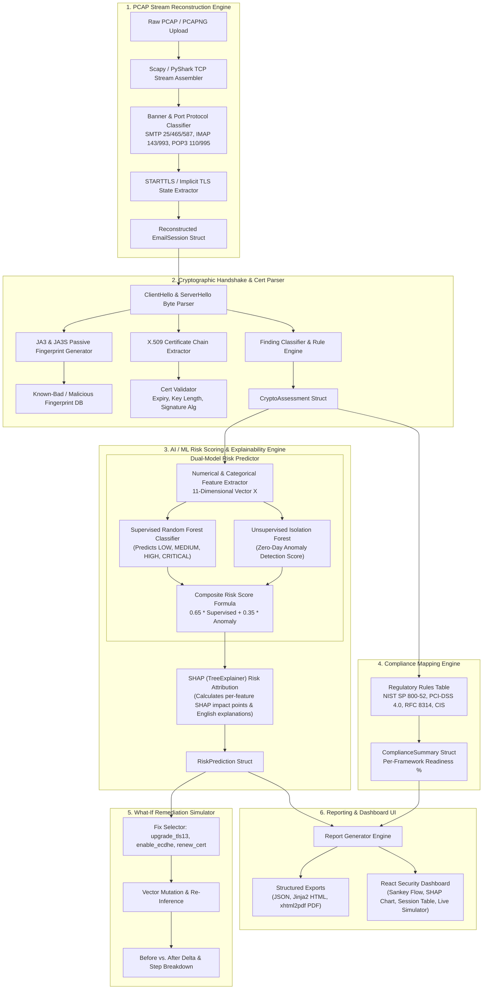

# System Architecture & AI/ML Pipeline Diagram

The **SENTINEL-TLS** framework operates as an offline, passive network forensic pipeline for evaluating email infrastructure cryptographic posture (SMTP, IMAP, POP3) without inspecting or decrypting email payloads.

## AI / ML Application Callouts

1. **Supervised Random Forest Classifier**
   - **Input**: 11-dimensional feature vector extracted from session handshake metadata.
   - **Output**: Multi-class severity prediction (`LOW`, `MEDIUM`, `HIGH`, `CRITICAL`) with confidence probabilities.

2. **Unsupervised Isolation Forest Anomaly Detector**
   - **Input**: Feature vector of active mail sessions.
   - **Output**: Continuous anomaly score (0.0 to 1.0) flagging zero-day misconfigurations or uncommon TLS stacks that bypass rule tables.

3. **SHAP (SHapley Additive exPlanations) TreeExplainer**
   - **Input**: Random Forest model + session feature vector.
   - **Output**: Exact feature attribution points and natural-language risk explanations.

4. **Predictive What-If Remediation Simulator**
   - **Input**: Active session vector + toggled security fixes.
   - **Output**: Real-time counterfactual model re-inference predicting risk score reduction points.
